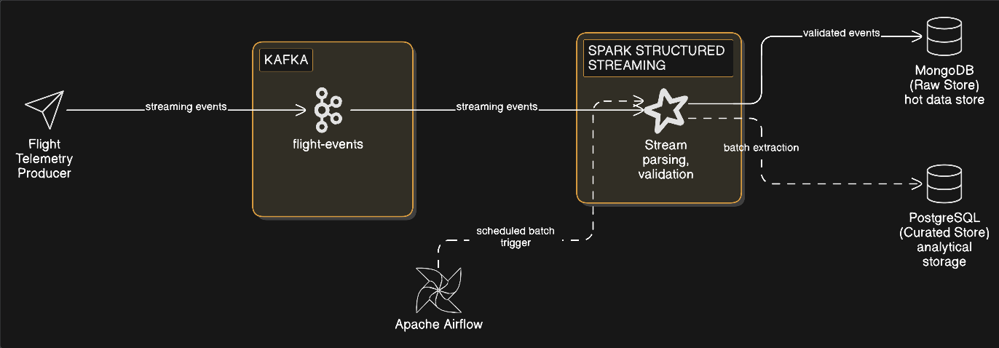

# AeroStream
**Real-Time Flight Data Streaming & Intelligence Platform**
--

##### Overview
AeroStream is a real-time, event-driven data platform for ingesting, processing, and persisting live flight telemetry.
The system is designed to clearly separate **streaming ingestion**, **batch orchestration**, and **analytical storage**.

--

##### Architecture


High-Level Flow
1. A flight telemetry producer emits live flight events
2. Apache Kafka buffers events and decouples producers from consumers
3. Apache Spark Structured Streaming processes events in near real time
4. MongoDB stores high-volume raw flight events
5. Apache Airflow orchestrates batch workflows
6. PostgreSQL stores curated, query-optimized flight data

--

##### Tech Stack
| Layer              | Technology                        |
| ------------------ | --------------------------------- |
| Data Ingestion     | Apache Kafka                      |
| Stream Processing  | Apache Spark Structured Streaming |
| Orchestration      | Apache Airflow                    |
| Raw Storage        | MongoDB                           |
| Analytical Storage | PostgreSQL                        |
| Containerization   | Docker / Docker Compose           |

--

##### Data Source
The system uses a **simulated flight telemetry feed** to emulate real-time aviation events.
This allows deterministic replay, controlled failure scenarios, and a focus on system reliability rather than external data availability.

--

##### Project Structure
```
producer/        # Flight data producers
spark/           # Streaming and batch Spark jobs
airflow/         # DAGs and orchestration logic
storage/         # Database schemas and setup scripts
docs/            # Architecture and design documentation
```

--

#### Current Milestone

##### Milestone 1 — Core Platform

**Goal:**
Establish a reliable end-to-end pipeline that ingests live events, processes them correctly, and persists them with clear component boundaries.

**Scope:**
* Streaming ingestion via Kafka
* Spark Structured Streaming to MongoDB
* Batch orchestration via Airflow
* Curated storage in PostgreSQL

No alerting, analytics, or prediction logic is included at this stage.

 Planned Milestones
* **Milestone 2:** Real-time analytics and alerting
* **Milestone 3:** Multi-consumer architecture and event modeling
* **Milestone 4:** Data correctness, reconciliation, and observability
* **Milestone 5:** Optional cloud integrations and scalability extensions

--

##### Design Principles
* Clear separation of streaming vs batch workloads
* Event-driven and decoupled components
* Deterministic, reproducible local execution
* Incremental evolution over premature complexity


